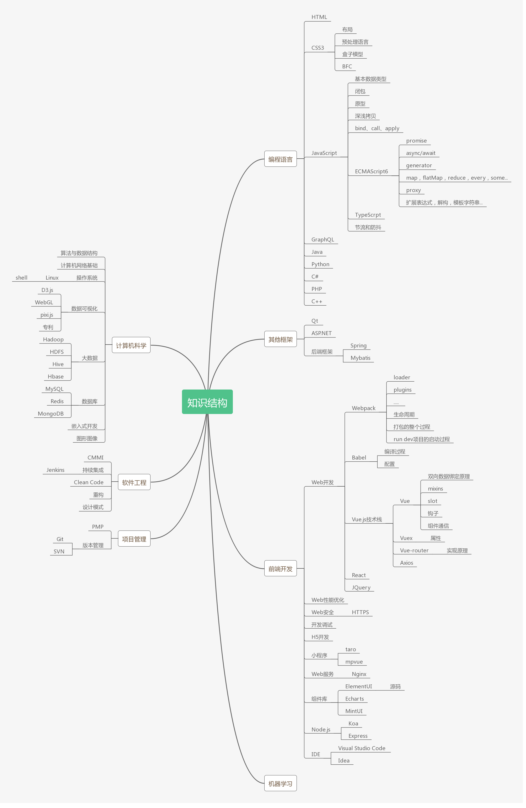

Computer Science Knowledge Structure，Front-end development
===============================
## 介绍
整理了一份计算机科学相关的知识图谱，目的是将知识结构聚点成线，开枝散叶，不断丰富、积累和深入，也让更多的人了解计算机科学或者软件工程，冰女为开发者丰富技能和强化竞争力提供帮助。

## 知识结构
- 编程语言
  - HTML
  - CSS
    - 布局
    - 预处理语言
    - 盒子模型
    - BFC
  - JavaScript
    - 基本数据类型
    - 闭包
    - 原型
    - 深浅拷贝
    - bind、call、apply
    - ECMAScript 6
      - promise
      - asycn/await
      - generator
      - map, flatMap, reduce, every, some...
      - proxy
      - 扩展表达式，解构，模板字符串...
    - TypeScript
    - 节流和防抖
  - GraphQL
  - Java
  - Python
  - C#
  - PHP
  - C++
- 前端开发
  - Web开发
    - Webpack
      - loader
      - plugins
      - 生命周期
      - 打包的整个过程
      - run dev项目的启动过程
    - Babel
      - 编译过程
      - 配置
    - Vue.js技术栈
      - Vue
        - 双向数据绑定原理
        - mixis
        - slot
        - 钩子
        - 组件通信
      - Vuex
        - 属性
      - Vue-router
        - 实现原理
      - Axios
    - React
    - JQuery
  - Web性能优化
  - Web安全
  - 开发调试
  - H5开发
  - 小程序
    - taro
    - mpvue
  - Web服务
    - Nginx
  - 组件库
    - ElementUI
      - 源码分析
    - Echarts
    - MintUI
  - Node.js
    - Koa
    - Express
  - IDE
    - Visual Studio Code
    - Idea
- 其他框架
  - Qt
  - ASP.NET
  - 后端框架
    - Spring
    - Mybatis
- 计算机科学
  - 算法与数据结构
  - 计算机网络基础
  - 操作系统
    - Linux
      - Shell
  - 数据可视化
    - D3.js
    - WebGL
    - pixi.js
  - 大数据
    - Hadoop
    - HDFS
    - Hive
    - Hbase
  - 数据库
    - MySQL
    - Redis
    - MongoDB
  - 嵌入式开发
  - 图形图像
- 软件工程
  - CMMI
  - 持续集成
    - Jenkins
  - Clean Code
  - 重构
  - 设计模式
- 机器学习
- 项目管理
  - PMP
  - 版本管理
    - Git
    - SVN
